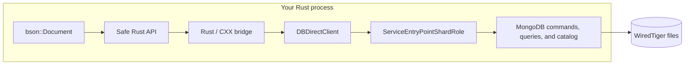

# Embedded MongoDB

**The MongoDB version of SQLite.**

Point it at a local directory and use familiar MongoDB documents, queries, and aggregations—without
deploying a database server.

> [!WARNING]
> **Proof of concept.** This project was created by
> [Jeroen Vervaeke](https://github.com/jeroenvervaeke). It is experimental, Linux-only, not
> production-ready, and not supported by MongoDB.

## Quick start

No server process, listening socket, or connection string:

```rust
use embedded_mongodb::bson::doc;

let client = embedded_mongodb::Client::new("./data")?;
let items = client.database("app").collection("items");
let inserted = items.insert_one(doc! { "name": "embedded" })?;
let item = items.find_one(doc! { "_id": inserted.inserted_id })?;
println!("{item:?}");
```

## Features

- 📦 **SQLite-like deployment** — open a local directory; no database server to install or manage.
- 🍃 **MongoDB data model** — use BSON documents, filters, cursors, aggregation pipelines, and
  direct commands.
- 🦀 **Rust-native API** — work with typed Serde collections or raw MongoDB documents.
- 💾 **Persistent storage** — clean close and reopen cycles preserve data in the supplied directory.
- 🧵 **Thread-safe access** — share one client across threads while commands are safely serialized.
- 🆔 **Automatic IDs** — missing `_id` fields receive an `ObjectId`, matching the official drivers.

## Examples

Explore the complete runnable examples:

- [Insert a document](examples/basic.rs)
- [Use typed collections](examples/advanced.rs)
- [Run an aggregation pipeline](examples/aggregation.rs)

## Test coverage

### ✅ Tested

- **Lifecycle and persistence** — open, clean close, reopen, and persistence on disk.
- **Documents and typing** — BSON and Serde-backed values, generated `ObjectId`s, `insert_one`, and
  `insert_many`.
- **Queries and cursors** — filtered `find`, `find_one`, array matching, comparison operators, and
  batched cursor `getMore`.
- **Commands** — `ping` through the public BSON `run_command` API.
- **Aggregation** — a multi-stage product report using `$match`, `$unwind`, `$group`, arithmetic,
  `$sort`, and `$project`.
- **Concurrency and errors** — `Client: Send + Sync`, concurrent inserts, and structured
  duplicate-key errors.
- **Observability** — MongoDB-to-`tracing` severity mapping.

One end-to-end integration test covers the operations demonstrated by all three examples.

### ⚠️ Not tested

- **Wider command set** — commands beyond those exercised by the covered helpers and `ping`.
- **Cursor cancellation** — early cursor drop and its `killCursors` cleanup path.
- **Advanced MongoDB features** — authentication, replication, transactions, change streams, TTL,
  backup, and encryption.
- **Failure and scale** — crash recovery, stress tests, and large-data workloads.
- **Portability and upgrades** — packaging, MongoDB upgrades, and non-Linux platforms.

## How it works

Everything runs inside the host process: no `mongod`, child process, listening socket, or MongoDB
wire protocol.



MongoDB is pinned as the shallow `mongo/` submodule. The `embedded-mongodb-sys` crate owns the
native implementation, CXX bridge, and build script; the safe Rust crate builds BSON helpers on
top. Startup uses a 256 MB WiredTiger cache plus a 64 MB spill cache.

## Observability

MongoDB logs are emitted through `tracing` under the `embedded_mongodb::mongo` target. Events carry
the MongoDB ID, component, context, severity, and lossless JSON record; open, command, and close
operations add spans. Without a subscriber the library remains silent. The basic example installs
`tracing-subscriber`.

## Benchmark

Criterion measures open, `insert_one`, `find_one`, and close separately:

```sh
cargo bench --bench operations
```

## Build and test

MongoDB's pinned build requires Python 3.13, Bazel, C++20, lld, and a supported compiler. Its build
documentation currently lists GCC 14.2 or Clang 19.1 and roughly 13 GB of free space.

```sh
git submodule update --init --depth 1

cd mongo
python3.13 buildscripts/install_bazel.py
export PATH="$HOME/.local/bin:$PATH"
cd ..
cargo test --workspace
```

`embedded-mongodb-sys/build.rs` runs the pinned Bazel target and rebuilds it incrementally when
the native sources change. Set `BAZEL` to use a Bazel executable outside `PATH`, or set
`EMBEDDED_MONGODB_NATIVE_LIB_DIR` to skip Bazel and use a prebuilt library. Native compilation is
limited to eight parallel jobs by default; override it with `EMBEDDED_MONGODB_BAZEL_JOBS`.
Cargo-run tests and examples find it through the sys crate's build output; standalone binaries
still need the shared library in the platform loader path.

The current fast-build shared library is about 1.4 GB. Size optimization and packaging are not part
of this spike.

## Hard constraints

- MongoDB server internals are private and change frequently. Each submodule update can require
  lifecycle and Bazel dependency work.
- Many server components assume one global runtime. Multiple simultaneous `Client` values or
  different active database directories are rejected.
- Commands issued through one `Client` are thread-safe but serialized, not run in parallel.
- There is no process isolation: a MongoDB fatal invariant, memory fault, or abort terminates the
  Rust host.
- Authentication, replication, transactions, change streams, TTL, backup, encryption, and the
  wider command set are outside the current supported scope.
- The current bridge is Linux-specific (`.so` loading and ELF startup initialization).
- MongoDB server code is SSPL-1.0. Distribution or service use requires a license review; see
  [`LICENSE-Community.txt`](mongo/LICENSE-Community.txt).

Production use would require owning a MongoDB fork, a narrow supported command matrix, crash
testing, packaging, and upgrade work.
