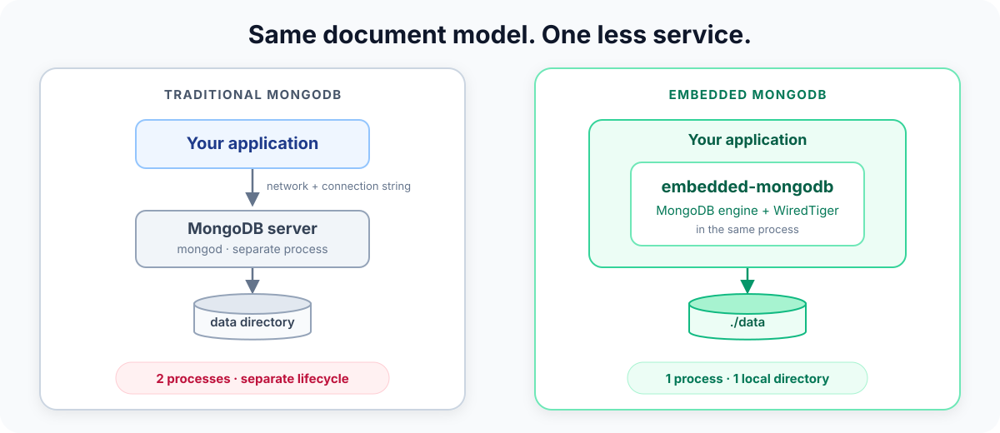

# Embedded MongoDB

[](https://github.com/jeroenvervaeke/embedded-mongo/actions/workflows/ci.yml)
[](https://github.com/mongodb/mongo/tree/e08eb5e22f1658f5074139e535efb9c68c15c41c)
[](LICENSE)

**The MongoDB version of SQLite.**

The real MongoDB engine, embedded directly in your application.

One process. One local directory. MongoDB's own queries, aggregations, commands, and WiredTiger
storage.

No server deployment. No ports. No connection string.

> [!WARNING]
> **Experimental.** This project was created by
> [Jeroen Vervaeke](https://github.com/jeroenvervaeke). It is not production-ready or supported by
> MongoDB.

## Features

**Not a MongoDB-compatible reimplementation. MongoDB's actual server code runs inside your
process.**

- 🍃 **Real MongoDB execution** — queries, cursors, aggregation pipelines, commands, and storage
  run through MongoDB's own engine, backed by WiredTiger.
- 📦 **SQLite-like deployment** — open a local directory; no database server to install or manage.
- 🦀 **Rust-native today, multi-language tomorrow** — work with typed Serde collections or raw
  MongoDB documents.
  - 🐍 **Python** — a binding can wrap the exported C ABI without changing the database engine.
  - 🟨 **JavaScript / Node.js** — the same boundary can expose the API to the JavaScript ecosystem.
- 💾 **Persistent storage** — clean close and reopen cycles preserve data in the supplied directory.
- 🧵 **Thread-safe access** — share one client across threads while commands are safely serialized.
- 🆔 **Automatic IDs** — missing `_id` fields receive an `ObjectId`, matching the official drivers.

## Deployment model



The directory uses MongoDB's native on-disk format. After a clean shutdown, hand it between
`embedded-mongodb` and the matching pinned `mongod` build; only one process may own it at a time.

<details>
<summary><strong>Technical implementation</strong></summary>

Commands travel from `bson::Document` through the safe Rust API, CXX bridge, `DBDirectClient`,
`ServiceEntryPointShardRole`, MongoDB command/query/catalog code, and finally WiredTiger.

MongoDB is pinned as the shallow `mongo/` submodule. The `embedded-mongodb-sys` crate owns the
native implementation, CXX bridge, and build script; the safe Rust crate builds BSON helpers on
top. Startup uses a 256 MB WiredTiger cache plus a 64 MB spill cache.

</details>

## Repairing a directory an older build damaged

> [!IMPORTANT]
> Directories written by a build published before this fix carry damaged indexes. Opening one
> with a current build repairs it automatically, moving rather than deleting any document it has
> to evict.

**The defect.** Starting the storage engine filled MongoDB's collection catalog and nothing
else — `DatabaseHolder::openDb` was never called for a database that already existed on disk,
so every collection loaded from such a directory came back with an empty in-memory index
catalog. Writes after that reopen went into the record store and into no index at all, `_id_`
included: a duplicate `_id` was accepted and both copies stayed, and documents written that way
are invisible to any query answered from an index while a collection scan still returns them.
Two counts of the same collection could disagree depending on the plan chosen.

**Which directories.** Any directory that was written to *after being reopened*, by a build
from before this fix. A directory that was only ever written to in the session that created it
is sound, and so is every directory a current build creates. Only the collections written to
after a reopen are affected; the rest of the directory is untouched.

**The repair.** `Client::new` checks a directory it did not create for missing index entries and
runs the engine's own `validate {repair: true}` over any collection that has them. It happens
once: a directory that has been through the pass carries a `.embedded-mongodb-index-repair`
marker and is not checked again, and a directory created by a current build is marked without
being checked at all. Everything it repairs is reported through `tracing` at `WARN`, naming the
collection, how many index entries were inserted, how many documents moved, and where they went.

Every binding opens through that same `Client::new` — `MongoClient("mongodb_embedded://…")` in
Python and `NativeBridge.open` on Android both go through it — so the pass, the marker and the
skip variable below behave identically whichever language opens the directory. Neither binding
installs a `tracing` subscriber, though, so the `WARN` records go nowhere unless the host
application has one: there, the marker and the repaired collections are what to look at.

The check is a full validation of every collection in the directory, so the first open after
upgrading is slower than the ones after it. That is the trade: one scan against silently wrong
query results.

**Evicted duplicates are moved, not deleted.** Where two documents ended up sharing an `_id`,
the index can only hold one of them. The other is *moved* into
`local.lost_and_found.<collection UUID>`, and the `WARN` record names that collection. Read it
back like any other:

```rust
let evicted = client.database("local").run_command(&doc! {
    "listCollections": 1,
    "filter": { "name": { "$regex": "^lost_and_found\\." } },
})?;
```

**One thing the repair can delete.** `validate {repair: true}` is the engine's general-purpose
repair, not one written for this defect alone. If it meets a record whose BSON cannot be read —
unrelated corruption, not anything this defect produces — it removes that record, and there is no
lost and found for those. The pass reports any such deletion in a `WARN` of its own, naming the
collection and the count. To look before anything is touched, set the variable below for one
open and run `validate` without `repair` yourself.

**Skipping it.** Set `EMBEDDED_MONGODB_SKIP_INDEX_REPAIR` to `1`, `true`, `yes` or `on` to leave
the check out. Any other value leaves it on — `no` and `off` included, deliberately, so that a
value nobody meant as yes cannot quietly switch off a repair. Skipping does not write the marker,
so it suppresses the pass rather than cancelling it: the next open without the variable set still
checks the directory.

**Forcing it.** Delete `.embedded-mongodb-index-repair` from the directory and the next open
checks it again. Worth knowing if a directory has been back to an older build since — the marker
records that a check happened, not which engine wrote the data afterwards.

**Doing it by hand.** The pass runs nothing you cannot run yourself. Per collection:

```rust
let report = client.database("shop").run_command(&doc! { "validate": "orders" })?;
// report.valid, report.errors, report.missingIndexEntries

let repaired = client.database("shop").run_command(&doc! { "validate": "orders", "repair": true })?;
// repaired.numInsertedMissingIndexEntries, repaired.numDocumentsMovedToLostAndFound
```

`validate {repair: true}` is idempotent, so running it against a sound collection changes
nothing. Note that its reply reports the state it *found*: a collection that is sound afterwards
can still come back with `valid: false` in the same reply that says `repaired: true`. Validate
again to see the result.

## Quick start

Open a directory, insert a document, and query it back:

```rust
use embedded_mongodb::bson::doc;

let client = embedded_mongodb::Client::new("./data")?;
let items = client.database("app").collection("items");
let inserted = items.insert_one(doc! { "name": "embedded" })?;
let item = items.find_one(doc! { "_id": inserted.inserted_id })?;
println!("{item:?}");
```

### Storage limits

mongod sizes its journal, its cache and its free-space floors for a server. The journal is the
one that is badly wrong inside a phone application: at mongod's settings an Ireland-scale
directory holding **2.25 MiB** of documents and indexes occupies **202 MiB**, because two
journal files are allocated in full whether or not anything is written to them. This engine
defaults to one 8 MiB journal file and no pre-allocated spare, which takes the same directory
to **10.25 MiB**. Cold open gets faster too, because recovery scans the journal at startup and
there is 25x less of it to scan.

Journalling itself is untouched: the files are smaller and there is one rather than two, but
every write is logged and fsynced exactly as before. `tests/durability` passes in full, and the
two properties it exists to pin are unchanged — a write acknowledged under `{w:1, j:true}`
survives `SIGKILL` (zero lost, measured), and recovery replays a strict prefix of the write
history rather than a torn one (no gaps, measured). Writes acknowledged *without* `j: true`
still lose the tail written since the last journal flush, which mongod performs every 100 ms.
That window did not widen: over ten killed runs each, the tail lost was 43-511 writes at
mongod's journal settings and 114-464 at these — overlapping ranges, with the worst single
run belonging to mongod's settings.

The cache and the free-space floors are left where they were, and all four are settable:

| Limit | Default | Set through |
| --- | --- | --- |
| Journal file size | 8 MiB (mongod: 100 MiB) | `Client::with_options` |
| Journal pre-allocation | off (mongod: on) | `Client::with_options` |
| WiredTiger cache | 256 MB | `Client::with_options` |
| Free disk to start an index build or spill a query | 500 MB, as mongod | `Client::with_options`, or `set_free_disk_floor` at any time |

The cache figure is the value this engine has always used, and is also the floor mongod will
not go below on a server; mongod's *default* is half of system memory above the first
gigabyte, which is not a number that means anything on a phone. It is a ceiling WiredTiger
grows into rather than memory it takes, and a cold read-only process at Ireland scale peaks
well under it, so it is exposed for tuning rather than because the default is wrong.

```rust
use embedded_mongodb::{Client, FreeDiskFloor, JournalFileSize, OpenOptions};

let options = OpenOptions::new()
    .journal_file_size(JournalFileSize::from_kibibytes(2048)?)
    .free_disk_floor(FreeDiskFloor::from_mebibytes(32)?);
let client = Client::with_options("./data", options)?;
```

Anything left unset keeps the engine's own default, so `Client::new(path)` and
`Client::with_options(path, OpenOptions::new())` open identically.

The free-space floor is the one worth thinking about before lowering. It is what stops an index
build or a spilling query from starting when the device is nearly full — and nothing stops one
that runs out part-way: WiredTiger answers a full disk by panicking, which takes the host
process down without an error reaching the caller. How much headroom is enough depends on how
much data is about to be indexed, which is why the default is left where MongoDB put it.

### Full examples

Explore the complete runnable examples:

- [Basic: insert a document](examples/basic.rs)
- [Typed: model and query a collection](examples/advanced.rs)
- [Aggregation: build a sales report](examples/aggregation.rs)

## Python

The `pymongo-embedded` package keeps PyMongo's API for remote servers and routes embedded URIs to
the in-process engine:

```py
from pymongo_embedded import MongoClient

remote = MongoClient("mongodb://localhost:27017/")
local = MongoClient("mongodb_embedded://./data")

local.app.items.insert_one({"name": "embedded"})
```

`mongodb+embedded://./data` is the URI-valid spelling and behaves identically.

Run the included [Python example](examples/python/basic.py) with:

```sh
./scripts/python
```

The runner creates a clean environment under `.cache/python`, builds incrementally, and uses the
sibling `mongo-python-driver` checkout. It also accepts normal Python arguments:

```sh
./scripts/python -i              # Open a Python shell.
./scripts/python your_script.py
./scripts/python -m pip install another-package
```

Set `PYMONGO_SOURCE` if the PyMongo checkout is elsewhere.

To build a distributable wheel containing the native engine:

```sh
python -m pip install "maturin[patchelf]"
maturin build --release
python -m pip install target/wheels/pymongo_embedded-*.whl
```

The first build downloads the published engine; see [Build and test](#build-and-test) for the
alternatives.

This package is not published to PyPI and is not installed from it. It is developed against a
`mongo-python-driver` checkout, which `./scripts/python` wires up for you; the wheel exists so
the engine can be vendored into one, not as a distribution.

The initial binding supports synchronous PyMongo 4.18 commands, including normal CRUD, cursors,
aggregations, and bulk document sequences. Authentication, TLS, compression, sessions,
transactions, change streams, exhaust cursors, and async PyMongo are not supported.

## What this unlocks

The embedded deployment model creates a path toward:

- 🖥️ **Local-first applications** with MongoDB data stored beside the app.
- 🧰 **Self-contained developer tools and CLIs** without a database service to provision.
- ✈️ **Offline and edge workloads** that keep working without network access.
- 🧪 **Tests and demos** that start with the application instead of waiting for infrastructure.
- 🌍 **One engine across ecosystems**, with Rust today and potential Python and JavaScript bindings.

## Test coverage

### ✅ Tested

- **Lifecycle and persistence** — open, clean close, reopen, and persistence on disk.
- **Documents and typing** — BSON and Serde-backed values, generated `ObjectId`s, `insert_one`, and
  `insert_many`.
- **Queries and cursors** — filtered `find`, `find_one`, array matching, comparison operators, and
  batched cursor `getMore`.
- **Commands** — `ping` through the public BSON `run_command` API.
- **Aggregation** — a multi-stage product report using `$match`, `$unwind`, `$group`, arithmetic,
  `$sort`, and `$project`.
- **Concurrency and errors** — `Client: Send + Sync`, concurrent inserts, and structured
  duplicate-key errors.
- **Observability** — MongoDB-to-`tracing` severity mapping.
- **Engine identity** — `buildInfo`, the `serverStatus` section and the `embeddedMongodb`
  command all report the embedded build and agree with one another.
- **Index repair** — a data directory a pre-fix engine damaged is checked in as a fixture, and the
  repair pass is held to repairing it, to running once, to leaving a healthy directory alone, and
  to moving rather than deleting a duplicate.

One end-to-end integration test covers the operations demonstrated by all three examples.

### ⚠️ Not tested

- **Wider command set** — commands beyond those exercised by the covered helpers and `ping`.
- **Cursor cancellation** — early cursor drop and its `killCursors` cleanup path.
- **Advanced MongoDB features** — authentication, replication, transactions, change streams, TTL,
  backup, and encryption.
- **Failure and scale** — crash recovery, stress tests, and large-data workloads.
- **Portability and upgrades** — automated `mongod` handoff, MongoDB upgrades, and Windows.

## Observability

MongoDB logs are emitted through `tracing` under the `embedded_mongodb::mongo` target. Events carry
the MongoDB ID, component, context, severity, and lossless JSON record; open, command, and close
operations add spans. Without a subscriber the library remains silent. The basic example installs
`tracing-subscriber`.

## Identifying the engine

Nothing can attach a shell or Compass to an in-process engine, so the engine says what it is
through three ordinary commands. Use any of them to assert in a test that you are running
against the embedded engine rather than a real `mongod`:

```rust
let build_info = client.run_command("admin", &doc! { "buildInfo": 1 })?;
// modules            = ["embedded"]
// buildEnvironment   = { …, embedded: "true", embeddedAuthor: "Jeroen Vervaeke" }

let status = client.run_command("admin", &doc! { "serverStatus": 1 })?;
// status.embedded    = { embedded: true, author, repository, mongoVersion }

let about = client.run_command("admin", &doc! { "embeddedMongodb": 1 })?;
// the same payload, as a command of its own
```

`modules` is the cheapest check; a real `mongod` never reports an `embedded` module.

`gitVersion` is deliberately left alone — it reports the MongoDB commit the engine was built
from, and the pinned commit is recorded in [`NOTICE`](NOTICE).

## Benchmark

Criterion measures open, `insert_one`, `find_one`, and close separately:

```sh
cargo bench --bench operations
```

## Build and test

The engine is not compiled locally. `cargo build` downloads the library published for the
current target, checks it against a SHA-256 committed in
`embedded-mongodb-sys/prebuilt.rs`, and links that:

```sh
cargo test --all-targets
```

No submodule, no Bazel, no C++ toolchain. The download is cached outside the target
directory — under `$XDG_CACHE_HOME/embedded-mongodb`, or `~/Library/Caches/embedded-mongodb`
on macOS — so `cargo clean` does not throw it away.

There are three modes, and the first match wins:

1. `EMBEDDED_MONGODB_NATIVE_LIB_DIR=<dir>` — use the `libembedded_mongodb_native.so` in
   `<dir>`, unconditionally. This is the answer for hermetic builds, air-gapped machines and
   distribution packaging.
2. `EMBEDDED_MONGODB_BUILD_FROM_SOURCE=1` — compile the engine from the pinned submodule.
   Hours, and about 13 GB of disk.
3. Otherwise, download the library published for this target.

`EMBEDDED_MONGODB_CACHE_DIR` moves the download cache, and `BAZEL` and
`EMBEDDED_MONGODB_BAZEL_JOBS` apply to a source build. There is no way to skip the checksum.

Two things to know before putting this behind a firewall. A plain `cargo build` now reaches
both `github.com` and `release-assets.githubusercontent.com`, so a proxy allowlist naming
only the first still fails. And `cargo build --offline` does **not** suppress the download —
cargo does not pass that flag to build scripts — while `CARGO_NET_OFFLINE=1` does, and turns
a missing cache entry into an error naming the file it wanted.

The published Linux libraries are built on Ubuntu 24.04 and therefore need **glibc 2.39 or
newer**; a source build has no such floor. Rather than failing at load time, `build.rs`
compares the requirement against the host and stops the build with the remedy.

Prebuilt libraries are published for `x86_64-unknown-linux-gnu`,
`aarch64-unknown-linux-gnu`, `aarch64-apple-darwin`, `aarch64-linux-android` and
`x86_64-linux-android`. Anything else — an Intel Mac, musl, a BSD — builds from source, which
a later section covers. Intel macOS is absent because that runner could not finish a build
inside GitHub's six-hour job limit, and GitHub retires the image in August 2027 regardless.

### Android

Both 64-bit ABIs are published, compiled against bionic at API level 24 — Android 7.0 — and
verified to load, open a database and answer commands on an API 24 device. 32-bit Android is
not supported: MongoDB builds only for 64-bit platforms.

The `embedded-mongodb` AAR sets `minSdk` 26 even so, because `org.bson` reaches for
`java.time` and that arrived in API 26; `android/README.md` has the detail. Rust callers
linking the engine directly are not bound by that and can target 24.

Cargo has to be told which toolchain to use. `cc`, which the `cxx` bridge and
`link-cplusplus` run, carries no NDK of its own and looks for a `<triple>-clang++` the NDK
does not ship:

```sh
ndk=$ANDROID_NDK_HOME/toolchains/llvm/prebuilt/linux-x86_64/bin
export CC_aarch64_linux_android=$ndk/aarch64-linux-android24-clang
export CXX_aarch64_linux_android=$ndk/aarch64-linux-android24-clang++
export AR_aarch64_linux_android=$ndk/llvm-ar
export CARGO_TARGET_AARCH64_LINUX_ANDROID_LINKER=$ndk/aarch64-linux-android24-clang
cargo build --release --target aarch64-linux-android
```

`cargo-ndk` sets the same variables, if you would rather not.

Ship two files with the application: `libembedded_mongodb_native.so` and the NDK's
`libc++_shared.so`. The engine links its own C++ runtime statically and exports only the six
`extern "C"` entry points, but the bridge compiled into the Rust crate uses the NDK's default
shared runtime, as any other NDK library in the same application does.

Neither Android library gets link-time optimization — those flags are GCC- and `ld.bfd`-
specific, and the NDK ships neither — so both land near 47 MB against the x86_64 Linux
build's 34 MB. They do get `--gc-sections`, identical code folding and the version script.

A source build needs `ANDROID_NDK_HOME` or `ANDROID_NDK_ROOT` pointing at an NDK r27 or
newer, and `EMBEDDED_MONGODB_ANDROID_API` overrides the API level. The NDK's clang
cross-compiles both ABIs from any host, so no Android hardware is involved in building one.

### Building the engine from source

Needed only to change the engine itself. MongoDB's pinned build requires Python 3.13, Bazel,
C++20, and a supported compiler and linker. Its build documentation currently lists GCC 14.2
or Clang 19.1 and roughly 13 GB of free space.

```sh
git submodule update --init --depth 1
./scripts/apply-mongo-patches

cd mongo
python3.13 buildscripts/install_bazel.py
export PATH="$HOME/.local/bin:$PATH"
cd ..
EMBEDDED_MONGODB_BUILD_FROM_SOURCE=1 cargo test --all-targets --release
```

`--release` is not optional once the patches are applied. Patches 0003, 0004 and 0006 leave
dangling references to the code they remove, and only the release build's link-time
optimization and `--gc-sections` eliminate them. A debug build links — nothing checks for
undefined symbols there — and then fails to load with `undefined symbol:
mongo::executor::makeNetworkInterface` or similar.

`embedded-mongodb-sys/build_native.rs` holds the Bazel invocation and rebuilds incrementally
when the native sources change. Cargo-run tests and examples find the library through the sys
crate's build output; standalone binaries still need it in the platform loader path.

Changing anything the published library was built from — the submodule pin, `patches/`,
`embedded-mongodb-sys/native/` or `build_native.rs` — makes the published library stale.
`build.rs` detects that and refuses to use it, rather than linking an engine that no longer
matches the source beside it. Publish a new one with `gh workflow run native.yml --ref
<branch> -f publish=true`, which builds every target and commits the regenerated manifest.

That comparison is against a commit, so it needs the history that holds it: clone this
repository in full, or `git fetch --unshallow` a shallow one. A shallow checkout that cannot
reach that commit is refused outright rather than built against a library nothing has
checked.

Sizes of the published libraries, as recorded in the manifest:

| target | bytes |
| --- | --- |
| `x86_64-unknown-linux-gnu` | 34,525,944 |
| `aarch64-unknown-linux-gnu` | 37,387,448 |
| `aarch64-apple-darwin` | 72,745,856 |

macOS is roughly twice the size because `native/BUILD.bazel` gates link-time optimization and
the version script on `@platforms//os:linux`, so it gets neither.

The release build is size-optimized rather than speed-optimized: `-Os`, link-time optimization,
per-function and per-data sections with `--gc-sections`, packed relative relocations, only the
six `extern "C"` entry points exported, and no TLS, gRPC, OpenTelemetry or enterprise modules.
Run `./scripts/apply-mongo-patches` before building. It trims the embedded ICU collation tables
(2.6 MB), removes the slot-based execution engine so queries run on the classic one (4.7 MB), the
replication implementation the embedded server never uses (1.1 MB), the sharding runtime (2.5 MB)
and the network stack (0.9 MB), and fixes an assertion that aborted the host process on the first
`hello` a driver sends. See
[`docs/native-size-reduction.md`](docs/native-size-reduction.md) for the measurements and what
further reduction would cost. Packed relative relocations require glibc 2.36 or newer.
LTO is linked with `ld.bfd`, which must be on `PATH`; lld cannot read GCC's IR. The C++ runtime
is linked statically, which costs a couple of megabytes and keeps a published library's
`GLIBCXX` requirement from following whichever toolchain happened to build it.

## Hard constraints

- MongoDB server internals are private and change frequently. Each submodule update can require
  lifecycle and Bazel dependency work.
- Many server components assume one global runtime. Multiple simultaneous `Client` values or
  different active database directories are rejected.
- Commands issued through one `Client` are thread-safe but serialized, not run in parallel.
- There is no process isolation: a MongoDB fatal invariant, memory fault, or abort terminates the
  Rust host.
- Authentication, replication, transactions, change streams, TTL, backup, encryption, and the
  wider command set are outside the current supported scope.
- Prebuilt libraries cover x86_64 and aarch64 Linux and aarch64 macOS. Intel macOS builds
  from source: that runner could not finish inside GitHub's six-hour job limit, and the
  image retires in August 2027. Windows is untested; see issue #9.
- This project embeds MongoDB Community Server as a modified work first published on 2026-07-27
  and licensed as a whole under SSPL-1.0. Distribution or service use requires a license review;
  see [`LICENSE`](LICENSE).

Production use would require owning a MongoDB fork, a narrow supported command matrix, crash
testing, and upgrade work.
