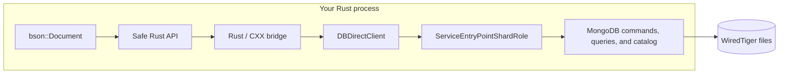

# Embedded MongoDB

**MongoDB queries, aggregation, and WiredTiger storage—embedded directly in your Rust process.**

No server. No socket. No wire protocol.

> [!WARNING]
> **Proof of concept.** This project was created by
> [Jeroen Vervaeke](https://github.com/jeroenvervaeke). It is experimental, Linux-only, not
> production-ready, and not supported by MongoDB.

## Quick start

Use the familiar MongoDB document API without starting a database server:

```rust
use embedded_mongodb::{Client, bson::doc};

let client = Client::new("./data")?;
let items = client.database("app").collection("items");
let inserted = items.insert_one(doc! { "name": "embedded" })?;
let item = items.find_one(doc! { "_id": inserted.inserted_id })?;
assert_eq!(item.unwrap().get_str("name")?, "embedded");
client.close()?;
# Ok::<(), anyhow::Error>(())
```

## Features

- ⚡ **Runs in-process** — `Client::new(path)` starts WiredTiger without `mongod` or a socket.
- 🦀 **Rust-native API** — database and collection handles are cheap, typed, and perform no I/O
  until an operation runs.
- 📚 **Familiar operations** — use `insert_one`, `insert_many`, `find_one`, batched `find`, and
  aggregation pipelines.
- 🧩 **Direct commands** — `run_command` accepts and returns BSON documents.
- 🆔 **Automatic IDs** — missing `_id` fields receive an `ObjectId`, matching the official drivers.
- 💾 **Persistent storage** — clean close and reopen cycles preserve data in the supplied directory.
- 🧵 **Thread-safe access** — share a `Client` across threads while its native `ClientStrand`
  serializes commands safely.
- 📦 **Bounded caches** — startup uses a 256 MB WiredTiger cache plus a 64 MB spill cache.
- 📌 **Reproducible engine** — MongoDB is pinned as the shallow `mongo/` submodule.

## Examples

### Insert a document

```sh
cargo run --release --example basic
```

```rust
use anyhow::Result;
use embedded_mongodb::{Client, bson::doc};

fn main() -> Result<()> {
    tracing_subscriber::fmt()
        .with_max_level(tracing::Level::DEBUG)
        .init();

    // The database files are deleted when this temporary directory is dropped.
    let data_directory = tempfile::tempdir()?;
    let client = Client::new(data_directory.path())?;
    let database = client.database("demo");
    let items = database.collection("items");

    let result = items.insert_one(doc! { "name": "embedded" })?;
    println!("inserted document id: {}", result.inserted_id);

    client.close()?;
    Ok(())
}
```

### Use typed collections

This example combines typed batch inserts, a filtered cursor, and `find_one`:

```sh
cargo run --release --example advanced
```

```rust
use anyhow::Result;
use embedded_mongodb::{
    Client,
    bson::{doc, oid::ObjectId},
};
use serde::{Deserialize, Serialize};

#[derive(Debug, Serialize, Deserialize)]
struct Book {
    #[serde(rename = "_id", skip_serializing_if = "Option::is_none")]
    id: Option<ObjectId>,
    title: String,
    year: i32,
    tags: Vec<String>,
}

fn main() -> Result<()> {
    // The database files are deleted when this temporary directory is dropped.
    let data_directory = tempfile::tempdir()?;
    let client = Client::new(data_directory.path())?;
    let library = client.database("library");
    let books = library.collection::<Book>("books");

    // Insert several typed Rust values at once.
    books.insert_many([
        Book {
            id: None,
            title: "Rust Foundations".to_owned(),
            year: 2019,
            tags: vec!["rust".to_owned()],
        },
        Book {
            id: None,
            title: "Embedded Databases".to_owned(),
            year: 2024,
            tags: vec!["database".to_owned(), "rust".to_owned()],
        },
        Book {
            id: None,
            title: "Storage Engines".to_owned(),
            year: 2025,
            tags: vec!["database".to_owned()],
        },
    ])?;

    // Query with MongoDB operators and deserialize every match into a Book.
    let recent_rust_books = books
        .find(doc! {
            "year": { "$gte": 2020 },
            "tags": "rust",
        })?
        .try_collect()?;
    assert_eq!(recent_rust_books.len(), 1);
    println!("recent Rust books: {recent_rust_books:#?}");

    // Use MongoDB's generated _id to read an inserted book back.
    let result = books.insert_one(Book {
        id: None,
        title: "MongoDB Inside Rust".to_owned(),
        year: 2026,
        tags: vec!["database".to_owned(), "rust".to_owned()],
    })?;
    let inserted_book = books
        .find_one(doc! { "_id": result.inserted_id })?
        .expect("inserted book should be found");
    assert_eq!(inserted_book.title, "MongoDB Inside Rust");
    println!("inserted and fetched: {inserted_book:#?}");

    client.close()?;
    Ok(())
}
```

### Run an aggregation pipeline

This example builds a product sales report from nested orders:

```sh
cargo run --release --example aggregation
```

```rust
use anyhow::Result;
use embedded_mongodb::{Client, bson::doc};

fn main() -> Result<()> {
    // The database files are deleted when this temporary directory is dropped.
    let data_directory = tempfile::tempdir()?;
    let client = Client::new(data_directory.path())?;
    let database = client.database("shop");
    let orders = database.collection("orders");

    orders.insert_many([
        doc! {
            "customer": "Ada",
            "status": "paid",
            "items": [
                { "product": "Keyboard", "quantity": 1, "unit_price": 100 },
                { "product": "Mouse", "quantity": 2, "unit_price": 25 },
            ],
        },
        doc! {
            "customer": "Grace",
            "status": "pending",
            "items": [
                { "product": "Monitor", "quantity": 1, "unit_price": 250 },
            ],
        },
        doc! {
            "customer": "Linus",
            "status": "paid",
            "items": [
                { "product": "Keyboard", "quantity": 2, "unit_price": 90 },
                { "product": "Mouse", "quantity": 1, "unit_price": 25 },
            ],
        },
    ])?;

    // Paid orders -> individual items -> totals per product -> highest revenue first.
    let pipeline = [
        doc! { "$match": { "status": "paid" } },
        doc! { "$unwind": "$items" },
        doc! {
            "$group": {
                "_id": "$items.product",
                "units_sold": { "$sum": "$items.quantity" },
                "revenue": {
                    "$sum": {
                        "$multiply": ["$items.quantity", "$items.unit_price"],
                    },
                },
            },
        },
        doc! { "$sort": { "revenue": -1 } },
        doc! {
            "$project": {
                "_id": 0,
                "product": "$_id",
                "units_sold": 1,
                "revenue": 1,
            },
        },
    ];

    let sales_report = orders.aggregate(pipeline)?.try_collect()?;
    assert_eq!(sales_report.len(), 2);
    assert_eq!(sales_report[0].get_str("product")?, "Keyboard");
    println!("sales report: {sales_report:#?}");

    client.close()?;
    Ok(())
}
```

## Test coverage

### ✅ Tested

- **Lifecycle and persistence** — open, clean close, reopen, and persistence on disk.
- **Documents and typing** — BSON and Serde-backed values, generated `ObjectId`s, `insert_one`, and
  `insert_many`.
- **Queries and cursors** — filtered `find`, `find_one`, array matching, comparison operators, and
  batched cursor `getMore`.
- **Commands** — `ping` through the public BSON `run_command` API.
- **Aggregation** — a multi-stage product report using `$match`, `$unwind`, `$group`, arithmetic,
  `$sort`, and `$project`.
- **Concurrency and errors** — `Client: Send + Sync`, concurrent inserts, and structured
  duplicate-key errors.
- **Observability** — MongoDB-to-`tracing` severity mapping.

One end-to-end integration test covers the operations demonstrated by all three examples.

### ⚠️ Not tested

- **Wider command set** — commands beyond those exercised by the covered helpers and `ping`.
- **Cursor cancellation** — early cursor drop and its `killCursors` cleanup path.
- **Advanced MongoDB features** — authentication, replication, transactions, change streams, TTL,
  backup, and encryption.
- **Failure and scale** — crash recovery, stress tests, and large-data workloads.
- **Portability and upgrades** — packaging, MongoDB upgrades, and non-Linux platforms.

## How it works

Everything runs inside the host process: no `mongod`, child process, listening socket, or MongoDB
wire protocol.



The `embedded-mongodb-sys` crate owns the native implementation, CXX bridge, and build script. It
exposes one raw command operation; the safe Rust crate builds BSON helpers on top.

## Observability

MongoDB logs are emitted through `tracing` under the `embedded_mongodb::mongo` target. Events carry
the MongoDB ID, component, context, severity, and lossless JSON record; open, command, and close
operations add spans. Without a subscriber the library remains silent. The basic example installs
`tracing-subscriber`.

## Benchmark

Criterion measures open, `insert_one`, `find_one`, and close separately:

```sh
cargo bench --bench operations
```

## Build and test

MongoDB's pinned build requires Python 3.13, Bazel, C++20, lld, and a supported compiler. Its build
documentation currently lists GCC 14.2 or Clang 19.1 and roughly 13 GB of free space.

```sh
git submodule update --init --depth 1

cd mongo
python3.13 buildscripts/install_bazel.py
export PATH="$HOME/.local/bin:$PATH"
cd ..
cargo test --workspace
```

`embedded-mongodb-sys/build.rs` runs the pinned Bazel target and rebuilds it incrementally when
the native sources change. Set `BAZEL` to use a Bazel executable outside `PATH`, or set
`EMBEDDED_MONGODB_NATIVE_LIB_DIR` to skip Bazel and use a prebuilt library. Native compilation is
limited to eight parallel jobs by default; override it with `EMBEDDED_MONGODB_BAZEL_JOBS`.
Cargo-run tests and examples find it through the sys crate's build output; standalone binaries
still need the shared library in the platform loader path.

The current fast-build shared library is about 1.4 GB. Size optimization and packaging are not part
of this spike.

## Hard constraints

- MongoDB server internals are private and change frequently. Each submodule update can require
  lifecycle and Bazel dependency work.
- Many server components assume one global runtime. Multiple simultaneous `Client` values or
  different active database directories are rejected.
- Commands issued through one `Client` are thread-safe but serialized, not run in parallel.
- There is no process isolation: a MongoDB fatal invariant, memory fault, or abort terminates the
  Rust host.
- Authentication, replication, transactions, change streams, TTL, backup, encryption, and the
  wider command set are outside the current supported scope.
- The current bridge is Linux-specific (`.so` loading and ELF startup initialization).
- MongoDB server code is SSPL-1.0. Distribution or service use requires a license review; see
  [`LICENSE-Community.txt`](mongo/LICENSE-Community.txt).

Production use would require owning a MongoDB fork, a narrow supported command matrix, crash
testing, packaging, and upgrade work.
